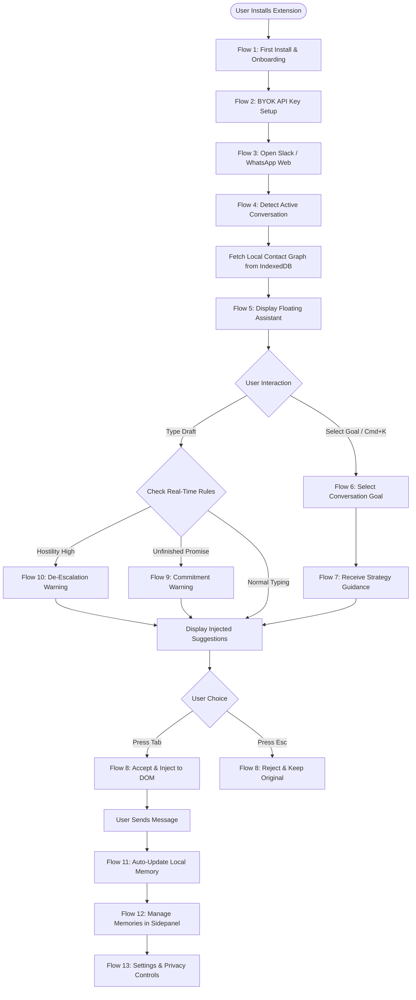

# USER_FLOW.md — End-to-End UX Architecture & Flow Specification

> **Design Philosophy**: Apple-grade elegance, Linear-level keyboard speed, OpenAI-tier intelligence.  
> **Core Principle**: Line-of-sight UX, zero cognitive friction, local privacy transparency.  
> **Target Surfaces**: Chrome Extension Popup, Sidepanel, and Web DOM Injections (Slack Web & WhatsApp Web).

---

## 1. Detailed Flow Specifications

---

### Flow 1: First Install & Onboarding

1. **User Goal**: Complete initial extension setup in under 30 seconds and understand how the copilot protects privacy while enhancing chat.
2. **Trigger**: User installs extension from Chrome Web Store; extension icon mounts to browser toolbar.
3. **User Actions**: Clicks extension icon or lands on post-install welcome drawer tab; reads 3-step value overview; clicks "Get Started".
4. **System Actions**: Initializes local IndexedDB database; sets default privacy flags (`local_only: true`); opens onboarding sidepanel.
5. **AI Actions**: Pre-warms local tokenizer/embedding worker in browser background.
6. **Success State**: Clear "Setup Ready" indicator with prompt to configure API key.
7. **Failure States**: IndexedDB initialization blocked due to browser incognito or restrictive security policies.
8. **Edge Cases**: User installs extension while already active on Slack/WhatsApp tabs (requires soft reload indicator).
9. **Empty States**: "No active chat detected yet. Open Slack or WhatsApp Web to see Rapport in action."
10. **Loading States**: Subtle pulsing Linear-style shimmer line while database initializes.
11. **Error Recovery**: One-click "Reset Local Database" button with clear instructions to allow browser storage.

---

### Flow 2: API Key Setup (Bring Your Own Key - BYOK)

1. **User Goal**: Securely connect an OpenAI, Anthropic, or Gemini API key without cloud data leakage.
2. **Trigger**: User reaches Step 2 of onboarding or opens Settings panel.
3. **User Actions**: Selects provider (OpenAI / Claude / Gemini); pastes API key; clicks "Validate & Save".
4. **System Actions**: Encrypts API key using Web Crypto API (`AES-GCM`); stores encrypted key in local browser sync storage; fires lightweight validation request.
5. **AI Actions**: Sends minimal token test ping (`/v1/models` or lightweight completion test) to verify key validity.
6. **Success State**: Green checkmark badge ("OpenAI Key Connected — GPT-4o-mini ready"); proceeds to active workspace.
7. **Failure States**: Key rejected (HTTP 401 Invalid Key) or rate limited (HTTP 429).
8. **Edge Cases**: User pastes key with trailing whitespace or line breaks; key belongs to account with zero quota.
9. **Empty States**: Input field formatted with password masking and clear placeholder (`sk-proj-...`).
10. **Loading States**: Button transforms into a sleek inline spinner with text "Validating with OpenAI...".
11. **Error Recovery**: Specific actionable error toast (*"Invalid Key format. Check your OpenAI dashboard quota"*), with direct link to provider key management page.

---

### Flow 3: Opening Slack / WhatsApp Web

1. **User Goal**: Open daily messaging platform without extension lag, intrusive popups, or DOM layout breaking.
2. **Trigger**: User navigates to `app.slack.com` or `web.whatsapp.com`.
3. **User Actions**: Interacts with Slack/WhatsApp as normal; selects a channel or direct message thread.
4. **System Actions**: Content script attaches mutation observers to target input selectors; mounts hidden Shadow DOM host root adjacent to text area.
5. **AI Actions**: Idle; standing by for active thread context parsing.
6. **Success State**: Ambient, low-contrast Rapport icon appears subtly in the corner of the input area (opacity 40%, brightens to 100% on hover/focus).
7. **Failure States**: Web app DOM updates class names or structure, preventing script from locating input textarea.
8. **Edge Cases**: User opens multiple Slack windows/canvases or WhatsApp popped-out chats simultaneously.
9. **Empty States**: Assistant indicator remains invisible until an active input container is focused.
10. **Loading States**: Zero visible loading state to preserve native web app performance.
11. **Error Recovery**: Fallback float button mounts to bottom-right window corner if relative input mounting fails.

---

### Flow 4: Detecting an Active Conversation

1. **User Goal**: Have the copilot seamlessly understand current contact history without manual thread copying or tagging.
2. **Trigger**: User clicks or switches into a active direct message thread or group conversation.
3. **User Actions**: Focuses target input field or reads thread messages.
4. **System Actions**: DOM Scraper extracts visible contact name, avatar, and recent 5-10 thread messages; hashes contact identity; queries IndexedDB for matching profile.
5. **AI Actions**: Evaluates thread context against local memory graph; extracts contact communication style tags (e.g. *Brevity-focused*, *Direct*, *Formal*).
6. **Success State**: Floating widget displays subtle recipient context pill (*"Active: Sarah Jenkins — Concise Style"*).
7. **Failure States**: DOM scraper cannot read contact name (e.g. encrypted or custom Slack canvas view).
8. **Edge Cases**: Group chats with 15+ active participants; switching between 1:1 DMs rapidly within 500ms.
9. **Empty States**: "New Contact — Memory Profile initializing on first exchange."
10. **Loading States**: Small micro-pulse indicator inside context pill during IndexedDB local lookup.
11. **Error Recovery**: Defaults to "General Professional" baseline profile if contact name cannot be resolved.

---

### Flow 5: Displaying the Floating Assistant

1. **User Goal**: Access copilot guidance in the line-of-sight without taking hands off keyboard or breaking typing flow.
2. **Trigger**: Input box receives focus or user hits universal shortcut (`Cmd + K` or `Ctrl + K`).
3. **User Actions**: Begins typing draft message or presses shortcut key.
4. **System Actions**: Expands Shadow DOM floating bar above input area; renders active tone pills and goal triggers with zero host page layout shift.
5. **AI Actions**: Pre-analyzes current typed draft for sentiment and commitment triggers.
6. **Success State**: Sleek floating control bar appears aligned to top-right of input field with micro-animations.
7. **Failure States**: Input area too small or constrained by screen viewport boundaries.
8. **Edge Cases**: Mobile browser viewport simulation; extreme zoom levels (200%+).
9. **Empty States**: Displays default action pills: `[ De-escalate ]` `[ Direct Refusal ]` `[ Make Concise ]` `[ Goal... ]`.
10. **Loading States**: Smooth 150ms transform-scale transition into view.
11. **Error Recovery**: Pressing `Esc` immediately dismisses control bar and restores focus to native textarea.

---

### Flow 6: Selecting a Conversation Goal

1. **User Goal**: Direct the copilot to achieve a specific interpersonal outcome (*Reach Consensus*, *De-escalate*, *Set Boundary*, *Friendly Follow-up*).
2. **Trigger**: User clicks a goal pill on the floating bar or types `/goal` inside input.
3. **User Actions**: Selects a goal preset or types custom intent (e.g. *"Push back on Friday deadline gracefully"*).
4. **System Actions**: Packages active DOM thread context, local contact memory profile, current draft text, and selected goal intent into structured prompt payload.
5. **AI Actions**: Formulates strategic response blueprint and begins streaming completion tokens.
6. **Success State**: Goal pill highlights with active glow; streaming preview card expands directly beneath control bar.
7. **Failure States**: Network error, invalid API key, or LLM rate limit.
8. **Edge Cases**: User changes goal selection mid-stream; draft text is completely erased while goal is processing.
9. **Empty States**: Quick-select menu presenting top 4 contextual goals based on thread sentiment.
10. **Loading States**: Streaming text effect with cursor pulsing; elapsed time indicator.
11. **Error Recovery**: Inline retry button with option to fallback to secondary tone preset.

---

### Flow 7: Receiving Strategy Guidance

1. **User Goal**: Review AI-suggested phrasing and strategic rationale before committing to send.
2. **Trigger**: AI model streams completion tokens to the preview overlay.
3. **User Actions**: Scans suggested draft text and brief strategy note (*"Why this works: Acknowledges client urgency while protecting team bandwidth"*).
4. **System Actions**: Renders formatted markdown preview inside Shadow DOM preview card with diff highlighting against original draft.
5. **AI Actions**: Streams final response tokens and appends suggested commitment tags.
6. **Success State**: Complete, highly polished draft displayed with clear action keys (`Tab` to Accept, `Esc` to Dismiss, `R` to Regenerate).
7. **Failure States**: Streaming connection terminates prematurely (partial completion).
8. **Edge Cases**: Suggested draft is longer than host platform message limits (e.g., Slack 4000 char limit).
9. **Empty States**: "Formulating optimal strategy..." card state.
10. **Loading States**: Smooth word-by-word streaming effect without jumping layout.
11. **Error Recovery**: "Resume Generation" or "Use Partial Draft" options on stream disconnect.

---

### Flow 8: Accepting or Rejecting Suggestions

1. **User Goal**: Replace rough draft with AI suggestion instantly or reject it with zero typing interruption.
2. **Trigger**: User presses `Tab` / `Enter` (to Accept) or `Esc` (to Reject).
3. **User Actions**: Presses `Tab` to insert suggestion; or `Esc` to keep original rough text.
4. **System Actions**: On Accept: Dispatches native input events (`InputEvent`, `change`) to host textarea, updating native React/Vue state in Slack/WhatsApp; collapses preview card. On Reject: Restores original text and collapses preview card.
5. **AI Actions**: Logs decision metrics locally (accepted vs rejected) to calibrate future contact style matching.
6. **Success State**: Input area populated with polished message; focus remains at end of text for immediate sending.
7. **Failure States**: Host web app ignores simulated input events (text updates visually but host send button remains disabled).
8. **Edge Cases**: User modifies text during streaming preview; double-tapping `Tab` rapidly.
9. **Empty States**: Clear micro-copy on preview footer (`Tab ↵ Accept  •  Esc Dismiss  •  Cmd+R Retry`).
10. **Loading States**: Instantaneous DOM injection (<16ms frame budget).
11. **Error Recovery**: One-click fallback button *"Copy to Clipboard"* if direct DOM injection is blocked.

---

### Flow 9: Commitment Guardrail Warning

1. **User Goal**: Avoid leaving chat without addressing previous promises made in thread.
2. **Trigger**: User types a sign-off message (e.g. *"Thanks, talk tomorrow!"*) while an unfulfilled commitment exists in thread history.
3. **User Actions**: Types sign-off text; sees yellow warning badge on control bar.
4. **System Actions**: Compares thread commitment log against current draft text; detects unaddressed promise (*"Unsent deliverable: Q3 Slides"*).
5. **AI Actions**: Generates 1-click commitment resolution pill (*"Mention Q3 Slides status"*).
6. **Success State**: Amber warning banner expands above input:  
   `⚠️ Pending Commitment: "Send Q3 Slides by 4 PM"`  
   `[ 1-Click Draft Status Update ]`
7. **Failure States**: False positive commitment warning on non-binding conversational chat.
8. **Edge Cases**: Commitment was fulfilled in an offline channel or verbal call.
9. **Empty States**: Warning auto-dismisses if user explicitly clicks *"Mark Fulfill / Ignore"*.
10. **Loading States**: Non-blocking background evaluation; warning appears smoothly without input focus lag.
11. **Error Recovery**: Easy 1-click *"Dismiss & Don't Remind Again for Sarah"* button.

---

### Flow 10: De-Escalation Warning

1. **User Goal**: Prevent accidental sending of emotionally hostile or defensive messages.
2. **Trigger**: User types a draft with high hostility, passive-aggression, or profanity index.
3. **User Actions**: Types aggressive message (e.g., *"Why didn't you check this before pushing? This is absurd."*).
4. **System Actions**: Content analyzer scores draft sentiment; hostility threshold exceeded; pauses direct send shortcut; displays red alert pill.
5. **AI Actions**: Pre-generates calm, constructive de-escalation alternative focused on problem-solving.
6. **Success State**: Soft red alert card mounts:  
   `🛑 Tone Alert: Defensive / Hostile`  
   `Suggested Alternative: "Let me understand what happened during the push so we can prevent this."`  
   `[ Press Tab to Replace with De-escalated Version ]`
7. **Failure States**: User intentionally wants to send a stern message and feels over-policed.
8. **Edge Cases**: Humor/sarcasm between close friends falsely flagged as hostility.
9. **Empty States**: Alert card provides an explicit override: `[ Send Original Anyway ]`.
10. **Loading States**: Real-time sentiment evaluation completes within 100ms of typing pause.
11. **Error Recovery**: User can disable De-Escalation warnings per contact in Sidepanel settings.

---

### Flow 11: Updating Local Memory

1. **User Goal**: Ensure the AI automatically remembers new contact preferences and commitments without manual data entry.
2. **Trigger**: Message is successfully dispatched into host chat thread.
3. **User Actions**: Sends message natively (hits `Enter` in Slack/WhatsApp).
4. **System Actions**: Intercepts send event; extracts key commitments, preferences, and interaction timestamps; updates local IndexedDB record for target contact.
5. **AI Actions**: Summarizes new rapport insight if thread contained significant relationship shift.
6. **Success State**: Silent local record update; subtle toast indicator in sidepanel if open (*"Memory updated for Sarah Jenkins"*).
7. **Failure States**: IndexedDB storage quota exceeded or write lock contention.
8. **Edge Cases**: Rapid fire 10 short messages sent in 5 seconds (debounce memory updates to 3-second idle window).
9. **Empty States**: N/A (Background operation).
10. **Loading States**: Asynchronous non-blocking web worker task.
11. **Error Recovery**: Automatic database compaction and pruning of oldest transient log entries if storage limit is approached.

---

### Flow 12: Managing Memories (Sidepanel Inspector)

1. **User Goal**: View, edit, or delete stored notes and rapport insights for any contact to maintain privacy and accuracy.
2. **Trigger**: User clicks extension icon or opens Chrome Sidepanel -> Selects "Memory Inspector".
3. **User Actions**: Searches for a contact; reviews stored tags, commitments, and style rules; edits or deletes specific memory nodes.
4. **System Actions**: Renders searchable list of contacts from IndexedDB; applies user edits/deletions in real time.
5. **AI Actions**: Re-indexes local contact vector representation post-edit.
6. **Success State**: Clean Linear-style list showing contact cards, memory nodes with `[Delete]` buttons, and a global `[Export My Data]` option.
7. **Failure States**: Contact list fails to load due to corrupted IndexedDB schema.
8. **Edge Cases**: Contact has 500+ stored log entries; contact name changed on host platform.
9. **Empty States**: "No relationship memory stored yet. Start chatting on Slack or WhatsApp Web to build your local graph."
10. **Loading States**: Fast skeletal card loader during initial IndexedDB query.
11. **Error Recovery**: "Rebuild Memory Index" button to repair local schema without data loss.

---

### Flow 13: Settings & Privacy Controls

1. **User Goal**: Maintain 100% control over data privacy, API keys, blacklisted domains, and extension behavior.
2. **Trigger**: User opens Extension Popup or Sidepanel Settings tab.
3. **User Actions**: Toggles privacy options (*"Local-First Mode"*, *"Zero Telemetry"*, *"Exclude Domains"*); manages custom prompt styles.
4. **System Actions**: Saves configuration flags to local storage; updates active content script listeners.
5. **AI Actions**: Adjusts temperature, model selection, or system prompt parameters according to user preferences.
6. **Success State**: Settings updated instantly with confirmation badge; zero background cloud transmission.
7. **Failure States**: Chrome storage sync fails.
8. **Edge Cases**: User blacklists `app.slack.com` while actively using extension on Slack.
9. **Empty States**: Clean structured toggle groups with clear explanatory subtext.
10. **Loading States**: Instant UI response (<10ms).
11. **Error Recovery**: "Reset to Default Privacy Settings" master switch.

---

## 2. End-to-End Master User Journey Diagram

---

## 3. Cognitive Load Analysis & Friction Reduction Plan

To achieve Apple and Linear-level UX benchmarks, we identify 4 key friction points in standard AI writing tools and eliminate them through intentional design choices:

### Friction Point 1: Modal & Popup Fatigue
* **The Problem**: Traditional extensions open intrusive popups, modals, or side panels that take user focus away from the chat thread.
* **UX Solution**: **Line-of-Sight Shadow DOM Injections**. All guidance, tone badges, and warnings mount directly *above* the input box. The user never moves their eyes more than 50 pixels away from where they are typing.

### Friction Point 2: Keyboard Breakage (Context Switching to Mouse)
* **The Problem**: Having to stop typing, pick up the mouse, click an extension icon, click a suggestion, and click insert.
* **UX Solution**: **Linear-Grade Keyboard Shortcuts**.
  - `Cmd + K`: Open Goal Palette.
  - `Tab`: Accept and replace draft.
  - `Esc`: Dismiss suggestion immediately.
  - `Cmd + Shift + D`: Trigger De-escalation rewrite.

### Friction Point 3: The "AI Uncanny Valley" Discomfort
* **The Problem**: Users worry AI drafts sound robotic or unlike themselves, forcing heavy editing.
* **UX Solution**: **Micro-Calibration over Full Generation**. Default to subtle 3-word tone shifts and diff preview cards that highlight *exact changes* made to the user's authentic draft, rather than replacing their voice with corporate fluff.

### Friction Point 4: Privacy Paranoia
* **The Problem**: Users fear an extension is secretly uploading their company Slack threads or WhatsApp chats to cloud servers.
* **UX Solution**: **Ambient Privacy Indicators**. A persistent, low-contrast badge on the assistant bar states: `🔒 Local-First Memory (0 Cloud Logs)`. The Sidepanel Memory Inspector gives 1-click `[Clear Memory for Sarah]` control at all times.
